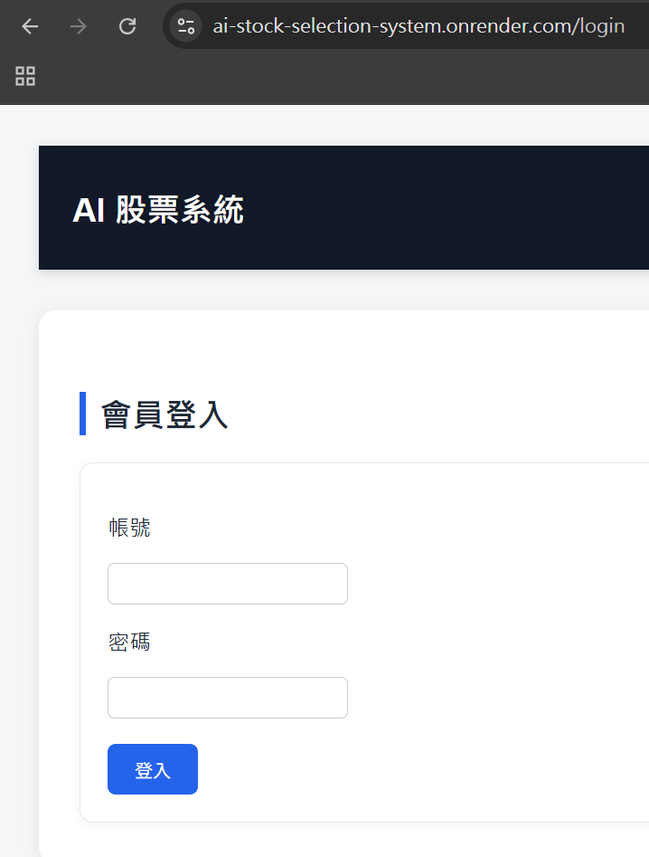
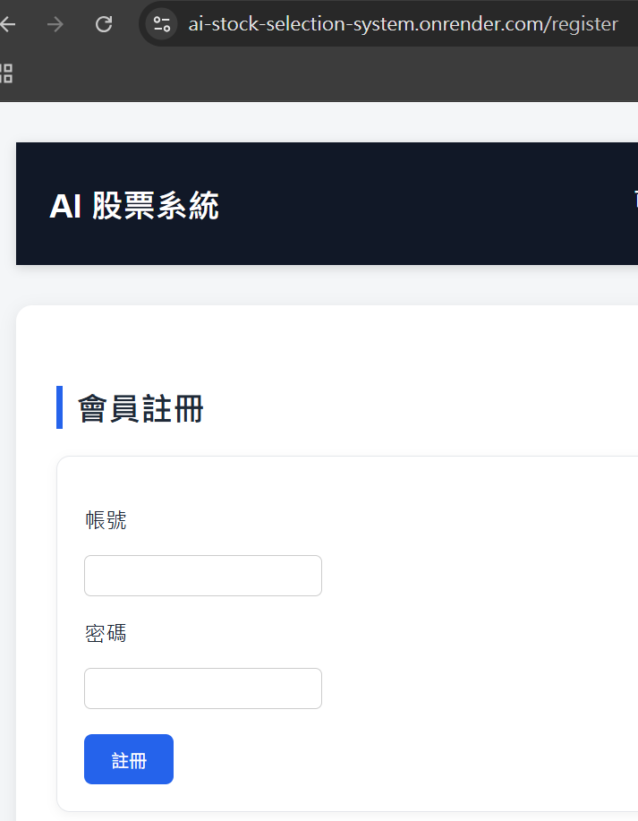
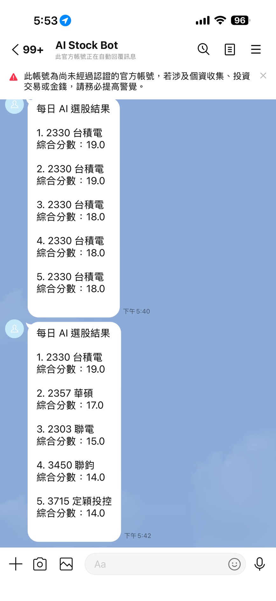
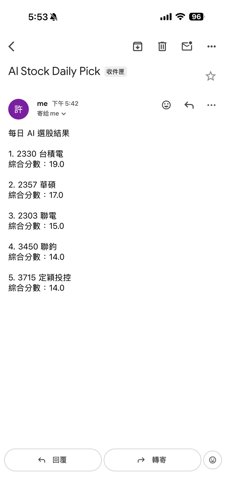
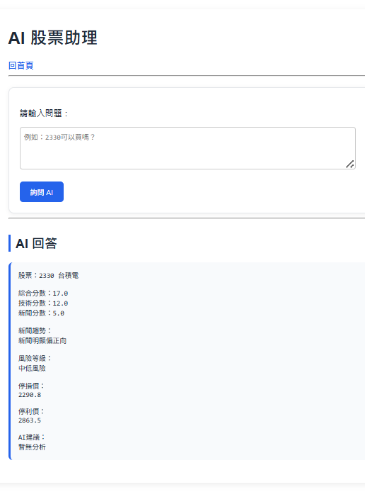
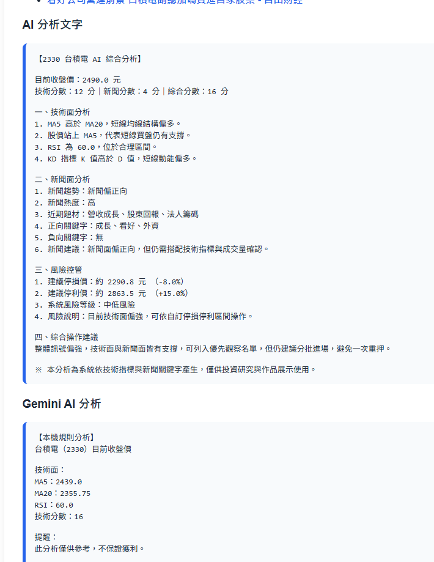

# AI 智慧股票選股與投資配置系統

## 專案介紹

本專案為使用 Python Flask 開發之智慧股票分析平台，整合台灣證券交易所（TWSE）資料、技術指標分析、新聞趨勢分析、Gemini AI 分析、會員系統、投資配置、回測系統、模擬投資與 Email 自動通知功能，協助使用者快速進行股票研究與投資決策。

系統支援即時查詢、股票比較、排行榜、投資組合配置、歷史回測、AI 選股推薦、會員登入管理與每日自動寄送選股通知，可作為投資輔助工具與個人作品集展示。

---

## 系統架構圖

本系統採用 Flask 作為後端框架，整合台灣證券交易所（TWSE）API、Google News RSS、Redis 快取、SQLite 資料庫、Gemini AI 分析服務、會員系統、Email 通知系統與 LINE Messaging API 通知服務。

系統透過 AI Analysis Service 整合技術分析、新聞分析與風險分析結果，並透過 APScheduler 自動排程每日選股通知。


## 技術架構

### 後端

* Python
* Flask
* Pandas
* Requests
* SQLite
* Redis
* Flask-Mail
* APScheduler
* Docker

### 前端

* HTML
* CSS
* Jinja2
* Chart.js

### AI 技術

* Gemini API
* Rule-Based Analysis

### 資料來源

* 台灣證券交易所（TWSE）
* Google News RSS

---

## 主要功能

### 股票查詢

* 股票代號查詢
* 股票名稱顯示
* 產業分類
* 收盤價
* 成交量

### 技術分析

* MA5
* MA20
* RSI
* KD 指標
* 成交量 MA5
* 技術評分系統

### 新聞分析

* Google News 自動抓取
* 新聞趨勢分析
* 利多利空關鍵字分析
* 新聞熱度分析
* 題材分析

### Gemini AI 分析

* Gemini API 整合
* AI 股票分析報告
* 自動產生投資建議
* 本機規則分析備援機制

### AI 分析報告

自動產生：

* 技術面分析
* 新聞面分析
* 風險分析
* 停損停利建議
* 綜合操作建議

### 股票排行榜

依照：

* 技術分數
* 新聞分數
* 綜合分數

進行排序。

### 股票比較

* 多檔股票比較
* 技術指標比較
* 綜合評分比較

### 投資配置系統

* 本金配置
* 產業分散
* 同產業最多兩檔
* 單一股票最高配置限制
* 停損停利建議

### 回測系統

* 歷史績效回測
* 勝率分析
* 平均報酬率
* 最大獲利
* 最大虧損
* 出場原因分析
* 投資組合資產曲線

### 模擬投資

* 模擬資金配置
* 模擬投資績效分析

### AI 選股

依據：

* 技術面
* 新聞面
* 風險等級

自動推薦投資標的。

### 會員系統

* 會員註冊
* 會員登入
* 會員登出
* Session 管理
* 個人查詢紀錄
* 個人化功能權限控制

### AI 股票助理

* 自然語言問答
* 股票資料分析
* 投資建議輔助

### Email 通知系統

* Gmail SMTP
* Flask-Mail
* AI 選股結果寄送
* APScheduler 自動排程
* 每日 18:00 自動寄送通知

---

## Docker 啟動

### 建立映像

```bash
docker compose build
```

### 啟動系統

```bash
docker compose up -d
```

### 查看容器

```bash
docker ps
```

### 關閉系統

```bash
docker compose down
```

---

## 系統頁面

* 首頁
* 排行榜
* 股票比較
* 投資配置
* 回測系統
* 回測歷史
* 模擬投資
* AI 選股
* AI 股票助理
* 會員登入
* 會員註冊

---

## 專案特色

* Gemini AI 股票分析
* AI 股票助理
* 即時股票查詢 API
* 技術分析自動化
* 新聞情緒分析
* 投資配置建議
* 歷史回測分析
* 模擬投資系統
* 會員系統
* Email 自動通知
* APScheduler 排程通知
* Redis 快取優化
* Docker 容器化部署
* 響應式網頁設計

---

## 已完成功能

### 第一階段：Gemini AI 分析

* Gemini AI 分析
* 本機規則分析備援機制
* 技術面分析（MA5、MA20、RSI、KD）
* 新聞分析整合
* AI 綜合投資建議
* 風險評估分析

### 第二階段：會員系統

* 會員註冊
* 會員登入
* 會員登出
* Session 管理
* 會員權限驗證
* 個人查詢紀錄管理

### 第三階段：通知系統

* Email 通知系統
* LINE 通知系統
* AI 選股通知
* APScheduler 自動排程
* 每日 18:00 自動通知
* Render 雲端排程執行

---

## 未來規劃

* 個人化 LINE 通知
* 個人化 Email 通知
* 美股支援
* ETF 智慧配置
* 停損停利即時通知
* 行動版介面優化
* RAG 股票知識庫
* AI 個人化投資推薦

---

## 專案成果

- 完成 Gemini AI 股票分析整合
- 完成會員系統開發
- 完成 Email 自動通知
- 完成 LINE Messaging API 通知
- 完成 Docker 容器化部署
- 完成 Render 雲端部署
- 完成 AI 股票助理
- 完成歷史回測系統

## 作者

許致恩

AI 智慧股票選股與投資配置系統 v2.1

---
## 系統畫面

### Dashboard


### 股票分析


### 股票排行榜


### 回測系統


### AI 選股推薦


### 會員登入



### 會員註冊



### LINE 通知



### Email 通知



### AI 股票助理



### Gemini AI 分析



---

## 線上 Demo

[線上 Demo](https://ai-stock-selection-system.onrender.com)

---

## Release Version

### v2.0

* Gemini AI 分析
* 會員系統
* Email 通知

### v2.1

* LINE Messaging API 通知
* APScheduler 每日自動通知
* Render 雲端排程通知

