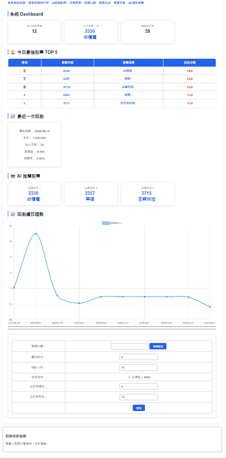
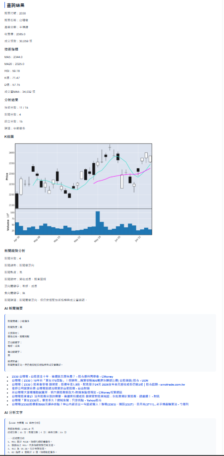
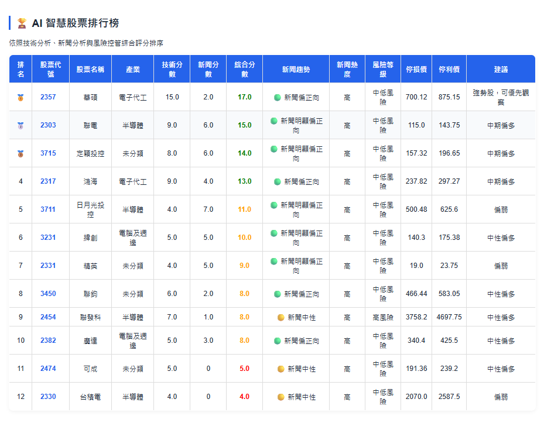
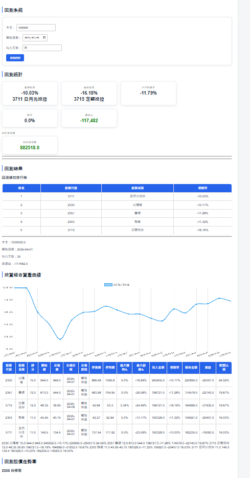
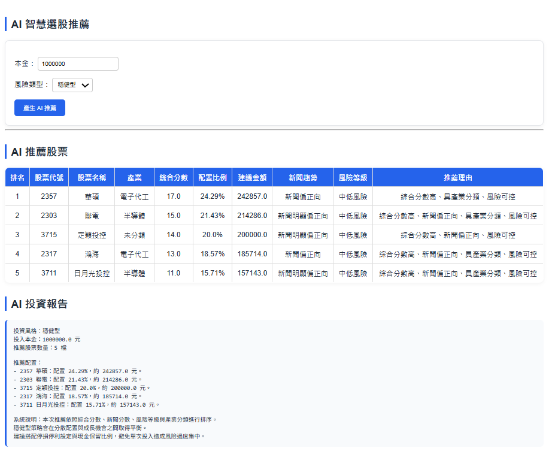
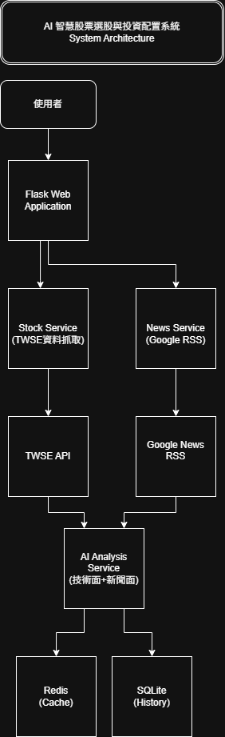

# AI 智慧股票選股與投資配置系統

## 專案介紹

本專案為使用 Python Flask 開發之智慧股票分析平台，整合台灣證券交易所（TWSE）資料、技術指標分析、新聞趨勢分析、投資配置、回測系統與 AI 分析報告功能，協助使用者快速進行股票研究與投資決策。

系統支援即時查詢、股票比較、排行榜、投資組合配置、歷史回測與 AI 選股推薦，可作為投資輔助工具與個人作品集展示。

---

## 技術架構

### 後端

* Python
* Flask
* Pandas
* Requests
* SQLite
* Docker

### 前端

* HTML
* CSS
* Jinja2
* Chart.js

### 資料來源

* 台灣證券交易所（TWSE）
* Google News RSS

---

## 主要功能

### 股票查詢

* 股票代號查詢
* 股票名稱顯示
* 產業分類
* 收盤價
* 成交量

### 技術分析

* MA5
* MA20
* RSI
* KD 指標
* 成交量 MA5
* 技術評分系統

### 新聞分析

* Google News 自動抓取
* 新聞趨勢分析
* 利多利空關鍵字分析
* 新聞熱度分析
* 題材分析

### AI 分析報告

自動產生：

* 技術面分析
* 新聞面分析
* 風險分析
* 停損停利建議
* 綜合操作建議

### 股票排行榜

依照：

* 技術分數
* 新聞分數
* 綜合分數

進行排序。

### 股票比較

* 多檔股票比較
* 技術指標比較
* 綜合評分比較

### 投資配置系統

* 本金配置
* 產業分散
* 同產業最多兩檔
* 單一股票最高配置限制
* 停損停利建議

### 回測系統

* 歷史績效回測
* 勝率分析
* 平均報酬率
* 最大獲利
* 最大虧損
* 出場原因分析
* 投資組合資產曲線

### 模擬投資

模擬資金配置與投資績效。

### AI 選股

依據：

* 技術面
* 新聞面
* 風險等級

自動推薦投資標的。

---

## Docker 啟動

### 建立映像

```bash
docker compose build
```

### 啟動系統

```bash
docker compose up -d
```

### 查看容器

```bash
docker ps
```

### 關閉系統

```bash
docker compose down
```

---

## 系統頁面

* 首頁
* 排行榜
* 股票比較
* 投資配置
* 回測系統
* 回測歷史
* 模擬投資
* AI 選股
* AI 聊天助手

---

## 專案特色

* 即時股票查詢 API
* 技術分析自動化
* 新聞情緒分析
* AI 分析報告
* 投資配置建議
* 歷史回測
* Docker 部署
* 響應式網頁設計

---

## 未來規劃

* RAG 股票知識庫
* OpenAI API 整合
* 多市場支援（美股、ETF）
* 使用者登入系統
* 雲端部署
* 自動排程選股

---

## 作者

許致恩

AI 智慧股票選股與投資配置系統 v2


## 系統畫面

### Dashboard



### 股票分析



### 股票排行榜



### 回測系統



### AI 選股推薦




## 系統架構圖

本系統採用 Flask 作為後端框架，整合 TWSE API、Google News RSS、Redis 快取與 SQLite 資料儲存，並透過 AI Analysis Service 統整技術分析與新聞分析結果。




## 線上 Demo

https://ai-stock-selection-system.onrender.com
